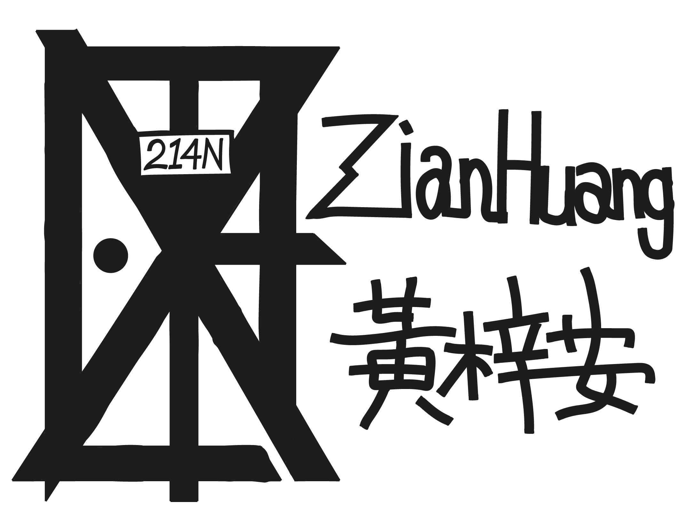

<h3 align="center"><a
              href="https://room214n.com"
              target="_blank"
              rel="noreferrer"
            >
              room214n.com
            </a> - my informal personal website</h3>

---

 

I write some study blogs on it. I've also put some coding projects and drawings of mine for people to have a look.
## About 

This website was first developed in the summer of 2021. The author will try his best to keep it updated and maintainable so his work can pay off in the long run.

It is runing on the [Next.js](https://nextjs.org/) frame work and application deployment is done using the recommended [Vercel](https://vercel.com/) platform.

## Author 

- Zian Huang [@zianonlyhk](https://github.com/zianonlyhk) - the programmer, the writer, and the graphic designer

## Acknowledgements 

- This is a stack-overflow-oriented project. The author has limited understanding on web development beyond personal website level. He is willing to learn more though.
- There is a link to the author's CV in the "About Me" session!
